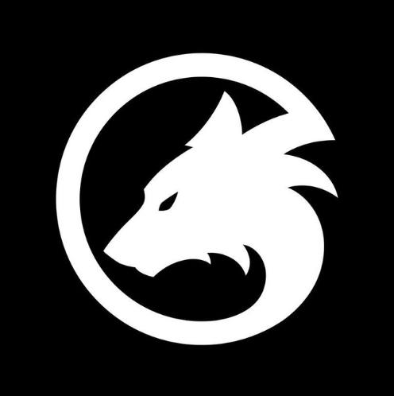
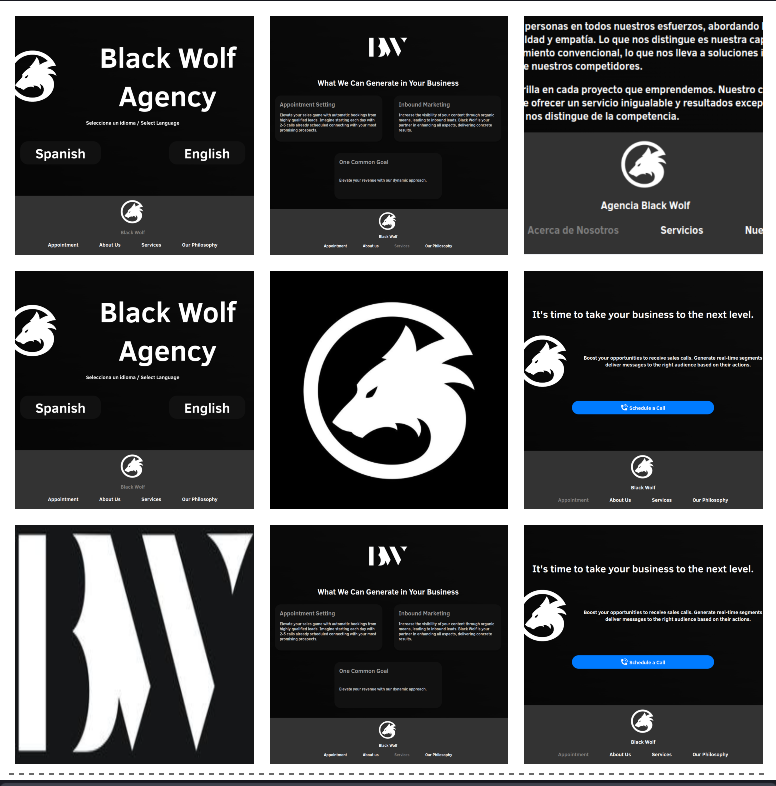

# Black Wolf Agency Website

Welcome to the Black Wolf Agency website project. This project showcases the web presence of our agency and provides information about our services, philosophy, and story.





## Getting Started

### Prerequisites

To work on this project, you need:

- Visual Studio Code (VSCode)
- The "Live Preview" extension for VSCode (`ms-vscode.live-server`)
- A web browser

### Clone the Repository

You can clone this repository using the following command:

```bash
git clone https://github.com/voscarmv/black-wolf-agency.git
cd black-wolf-agency
code .
```

## Running the Project

Open the project folder in Visual Studio Code.

Install the "Live Preview" (ms-vscode.live-server) extension if you haven't already.

Open the `index.html` file in VSCode and use the "Go Live" feature from the "Live Preview" extension to launch a local development server. This allows you to preview the website in your web browser.

Make changes to the HTML, CSS, or other files as needed. The browser will automatically reload to reflect your changes.

## Good Practices

This project follows some good practices for web development:

**Mobile-First Approach**: The project is designed with a mobile-first approach, ensuring a responsive and user-friendly experience on various screen sizes.

**Media Query for Motion**: The project includes a media query to avoid unnecessary motion if the user has motion sensitivity preferences set in their browser.

**Social Media Tags**: Open Graph and Twitter Card meta tags are included for easy sharing on social media platforms, ensuring that the shared content looks great.

## Next Steps

As we continue to develop and improve the Black Wolf Agency website, here are some potential next steps and improvements to consider:

1. **Performance Optimization**: Evaluate and optimize the website's performance, including reducing load times and optimizing images.

2. **Enhanced Interactivity**: Consider adding more interactive features or animations to enhance user engagement.

3. **Content Updates**: Keep the website content up-to-date with the latest information about our agency's services, philosophy, and story.

4. **Advanced SEO**: Implement advanced SEO techniques to improve search engine rankings and visibility.

5. **Security Enhancements**: Review and enhance the website's security measures to protect against potential vulnerabilities.

6. **Internationalization**: Implement internationalization (i18n) to support multiple languages and regions.

7. **User Feedback**: Collect and integrate user feedback to make data-driven improvements to the website.

8. **Regular Maintenance**: Schedule regular maintenance and updates to keep the website running smoothly.

By continuously striving to enhance the website, we can provide an outstanding online experience for our audience.

If you have any suggestions for further improvements or questions about these practices, please don't hesitate to share them with the team.

## Contributing

If you want to contribute to this project, feel free to fork the repository and create a pull request. We appreciate your contributions!

Please check the [Contribution guidelines](CONTRIBUTING.md) to keep the code clean!

## Acknowledges

- https://css.gg/ Icon of phone
- https://favicon.io/ for favicon from png
- https://www.fontsquirrel.com/fonts/clear-sans for the font

*Website created with ❤️ by Black Wolf Agency.*